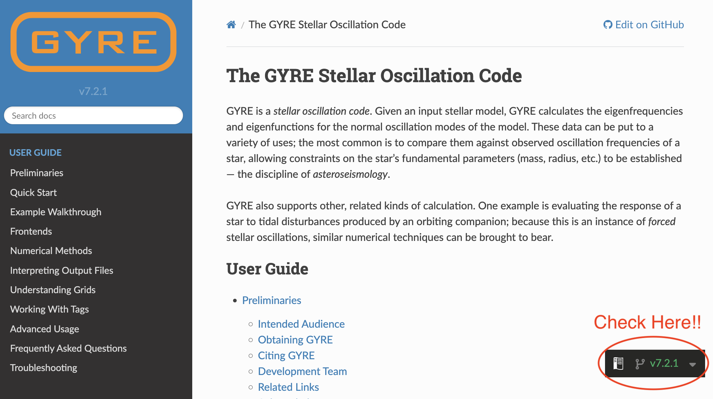

# Lab 1 Intro to GYRE, g-mode asteroseismology

## Learning Goals

- Install GYRE

---

`MESA` is distributed with two codes for stellar oscillations:

- [`GYRE`](https://gyre.readthedocs.io/en/stable/), by R. H. D. Townsend, and
- [`ADIPLS`](https://ui.adsabs.harvard.edu/abs/2008Ap%26SS.316..113C/abstract), by J. Christensen-Dalsgaard.

The calculations performed by the two are essentially equivalent, with the main tradeoff being between performance and ease of use. In this tutorial, we will restrict our attention to `GYRE`, which is much easier to get started with.

## Installing GYRE

GYRE comes automatically packed in with your MESA installation. For MESA version 24.08.1, the shipped GYRE version is 7.2.1. However, GYRE has since updated to version 8.0. Be sure that you are viewing the docs for the correct version number of the GYRE version that you are using. For GYRE 7.2.1, the link to the documentation is [here](https://gyre.readthedocs.io/en/v7.2.1/index.html).

See the screenshot below to check for the correct GYRE version when viewing the docs. If you see "latest" or "stable" here, that indicates you are viewing version 8.0 (for now, until a new update comes out).


The [GYRE Docs](https://gyre.readthedocs.io/en/v7.2.1/ref-guide/installation.html) contains a tutorial for GYRE installation. However, since we are not installing GYRE from a tar file, we will slightly modify what is written in this guide. The instructions are copied below with explicit changes listed.

### Extracting GYRE
We will not need to extract the GYRE source code from a tar file, as it is already extracted. 

### Set Environment Variables
Secondly, we will set the environment variable `$GYRE_DIR` equal to the following:
```export GYRE_DIR=$MESA_DIR/gyre/gyre```

Remember that this is best placed inside your shell's RC file in your home directory (usually `.bashrc` or equivalent), similarly to when you first installed MESA. **Don't forget to `source` this file to apply the changes to your terminal window!**

### Compile
Now, we can follow the GYRE installation guide from this point. Go ahead and compile:

```make -j -C $GYRE_DIR install```

### Test
Once that's complete, it's good practice to run the test suite to ensure nothing has gone wrong during the installation process:

```make -C $GYRE_DIR test```

> [!NOTE]
> If all the tests read "...succeeded" then you are good to move on to the next step. If that's not the case, ask your TA or a developer for help. 

---

